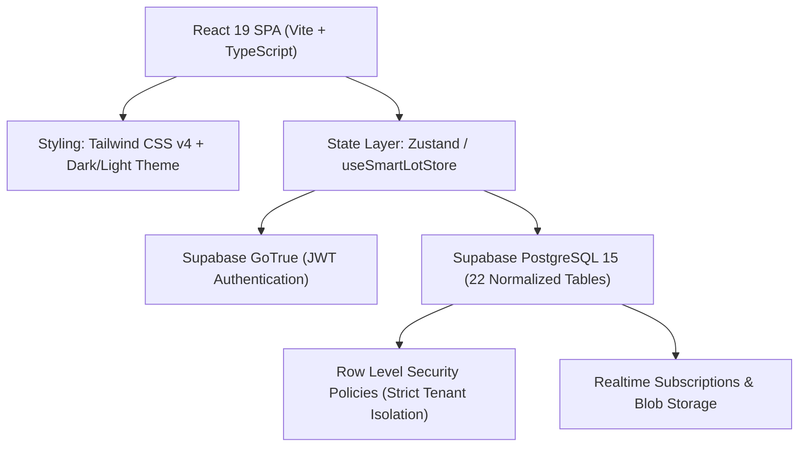

# SmartLot — Next-Generation Strata Operations Platform

[](https://www.typescriptlang.org/)
[](https://react.dev/)
[](https://tailwindcss.com/)
[](https://supabase.com/)
[](https://smart-lot-five.vercel.app)
[]()

> **SmartLot** is an enterprise-grade, multi-tenant Strata Management & Community Operations platform designed for Australian and international strata schemes, residential communities, and commercial body corporates.

---

## 🔗 Live Deployment & Quick Links

* **Live Application**: [https://smart-lot-five.vercel.app](https://smart-lot-five.vercel.app)
* **Master System Console**: [https://smart-lot-five.vercel.app/#/admin](https://smart-lot-five.vercel.app/#/admin)
* **Trade Contractor Portal**: [https://smart-lot-five.vercel.app/#trade-portal](https://smart-lot-five.vercel.app/#trade-portal)
* **Master Platform Documentation**: [`docs/PLATFORM_DOCUMENTATION.md`](docs/PLATFORM_DOCUMENTATION.md)
* **Database Schema Guide**: [`docs/DATABASE_SCHEMA_EXPLANATION.md`](docs/DATABASE_SCHEMA_EXPLANATION.md)
* **Credentials & Testing Playbook**: [`docs/SHARE_CREDENTIALS.md`](docs/SHARE_CREDENTIALS.md)

---

## 🏛️ System Architecture

SmartLot uses a modern decoupled architecture with single-page reactive state, sub-second parallel data fetching, and zero-trust database security:



---

## 🚀 Key Feature Modules

### 1. 🏢 Multi-Tenant Strata Portfolios
* **Dynamic Schemes**: Supports self-managed duplexes (`SP101`), medium residential complexes (`SP102`), high-density towers (`SP103`), and multi-building corporate portfolios (`SP823`).
* **Multi-Site Switching**: Professional strata managers can switch between buildings in 1 click from the topbar without logging out.

### 2. ⚡ 4-Stream Statutory Triage Engine
Tickets are automatically routed into statutory strata compliance streams:
1. **Common Area Repairs**: Section 106 repair duties with contractor quote solicitation.
2. **Emergency Repairs**: 24/7 priority dispatch with automated SMS/email alerts.
3. **Lot Owner Modifications**: Section 110 minor/major cosmetic renovation approval flow.
4. **By-Law Breaches & Noise Disputes**: Formal breach notices and mediation timeline tracking.

### 3. 🛠️ Contractor Tender & Work Order Pipeline
* **Licensed Trade Accreditation**: Real-time license verification and Public Liability Insurance expiry checks.
* **Competitive Bidding**: Request 2-3 quotes per maintenance ticket (`QTE-...`).
* **Committee Voting**: Strata committee members vote on proposals with automatic quorum tracking.
* **Official Work Orders**: Automated dispatch of purchase orders (`WO-...`) with scope and budget.

### 4. 🛡️ Super Admin Control Hub (`/#/admin`)
* **Global Oversight**: Real-time portfolio metrics across all schemes, lots, and open tickets.
* **Remote Inspection Mode**: Impersonate any building's dashboard as a virtual auditor with a persistent safety banner and 1-click return.

### 5. 🎨 Design & Accessibility
* **Dark / Light Mode**: Unified theme palette matching Linear and Stripe design aesthetics.
* **WCAG 2.1 AA Compliant**: High-contrast ratios, keyboard focus rings, and screen-reader `aria-label` tags throughout.

---

## 🧪 Testing Personas & Login Credentials

All persona accounts are pre-configured in live Supabase Auth:

| Persona | Role | Scheme | Email / Identifier | Password | Access Experience |
| :--- | :--- | :--- | :--- | :--- | :--- |
| **Super Admin** | System Admin | Global Platform | `admin` | `admin123` | Master System Console (`/#/admin`) |
| **Emma Wilson** | Strata Manager | Cavalier (`SP103`) & Coronation (`SP102`) | `emma.wilson@agency.com` | `SmartLot2026!` | Multi-site portfolio & triage management |
| **Sarah Jones** | Owner / Strata Admin | Sunset Duplex (`SP101`) | `sarah.jones@duplex.com` | `SmartLot2026!` | Self-managed duplex administration |
| **Michael Chen** | Committee Member | Coronation (`SP102`) | `michael.chen@coronation.com` | `SmartLot2026!` | Committee triage & quote voting |
| **David Miller** | Tenant | Sunset Duplex (`SP101`) | `david.m@duplex.com` | `SmartLot2026!` | Tenant noticeboard & requests |
| **Liam Hemsworth** | Resident | Coronation (`SP102`) | `liam.h@coronation.com` | `SmartLot2026!` | Active noise dispute queue |
| **Chloe Bennett** | Tenant | Coronation (`SP102`) | `chloe.b@coronation.com` | `SmartLot2026!` | Tenant portal |
| **Oliver Vance** | Resident | Cavalier Grand (`SP103`) | `oliver.v@cavalier.com` | `SmartLot2026!` | Resident portal |
| **Jessica Taylor** | Tenant | Cavalier Grand (`SP103`) | `jessica.t@cavalier.com` | `SmartLot2026!` | Tenant portal |
| **Roman Joe** | Strata Manager | Spear Empire (`SP823`) | `romanjoe@gmail.com` | `SmartLot2026!` | Dedicated manager console |
| **Trade Contractor** | Vendor | Commercial Tenders | *Open Registration* | *N/A* | Contractor Onboarding (`/#trade-portal`) |

> **Note**: For Super Admin, click the **Auto-fill Master Credentials** button on the login screen for instant 1-click access.

---

## 🔒 Security & Row-Level Security (RLS)

SmartLot enforces zero-trust data segregation. All 22 database tables utilize tenant-isolated RLS policies:
* Users only receive query results for schemes where they possess verified membership in `scheme_members`.
* Cross-scheme inspection is restricted exclusively to authenticated users with `profiles.is_system_admin = TRUE`.
* All SQL scripts and migrations eliminate `USING (true)` bypass vulnerabilities (OWASP A01).

---

## 🛠️ Local Development Setup

### Prerequisites
* **Node.js**: `>= 18.0.0`
* **npm**: `>= 9.0.0`

### Step-by-Step Installation

```bash
# 1. Clone the repository
git clone https://github.com/Codewithjainam7/SmartLot.git
cd SmartLot

# 2. Install dependencies
npm install

# 3. Environment Variables
# Create a .env file with your Supabase project credentials:
VITE_SUPABASE_URL=https://pieplmpkognbdktezteb.supabase.co
VITE_SUPABASE_ANON_KEY=your_supabase_anon_key

# 4. Start local development server
npm run dev

# 5. Verify TypeScript compilation
npx tsc --noEmit
```

The application will be available at [http://localhost:3000](http://localhost:3000).

---

## 📚 Documentation Index

* [`docs/PLATFORM_DOCUMENTATION.md`](docs/PLATFORM_DOCUMENTATION.md) — Master Technical & Architecture Specification.
* [`docs/SHARE_CREDENTIALS.md`](docs/SHARE_CREDENTIALS.md) — Test Credentials & 5 Core Evaluator Journeys.
* [`docs/DATABASE_SCHEMA_EXPLANATION.md`](docs/DATABASE_SCHEMA_EXPLANATION.md) — 22-Table Entity Dictionary & One-Liners.
* [`docs/VENDOR_SCHEMA_DOCUMENTATION.md`](docs/VENDOR_SCHEMA_DOCUMENTATION.md) — Trade Contractor & Work Order Architecture.
* [`docs/PERMISSIONS_MATRIX.md`](docs/PERMISSIONS_MATRIX.md) — Role & Individual Permission Matrix.

---

## 📄 License & Attribution

Copyright © 2026 SmartLot Strata Management. Built with Google Antigravity.  
Author: **Jainam Jain** (`jainjainam412@gmail.com`).
