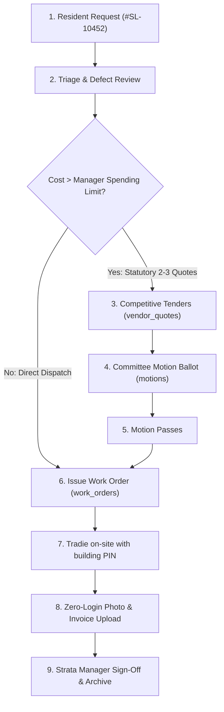
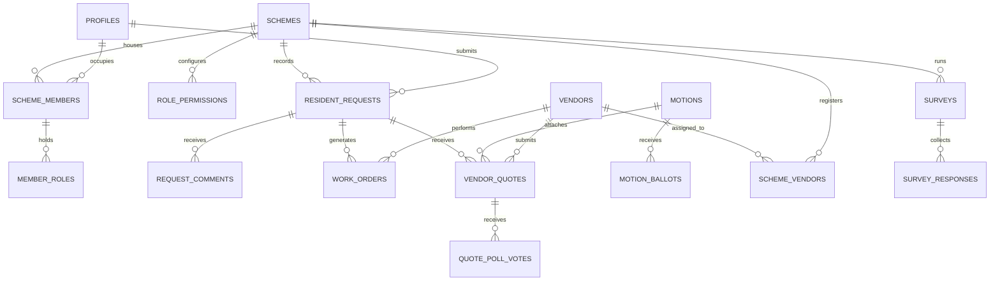

# SmartLot Database Architecture & Schema Explainer
> **A complete, plain-English reference guide explaining every table, column, and relationship across the SmartLot platform.**

---

## 1. Executive Summary & Core Lifecycle Flow

SmartLot is an enterprise multi-tenant strata management platform designed for Australian strata governance standards (**NSW Strata Schemes Management Act 2015** & **VIC Owners Corporations Act 2006**).

The database architecture links the entire lifecycle of a strata building into one continuous chain:

---

## 2. High-Level Entity Relationship Diagram (ERD)

---

## Module 1: Identity, Schemes & Building Memberships

### 1. `schemes`
**Purpose:** Stores each building or strata scheme managed in the system (e.g., *Cavalier Grand Residences SP52042*).

| Column | Type | One-Liner Plain English Explanation |
| :--- | :--- | :--- |
| `id` | `UUID` | Unique internal identifier for the building scheme. |
| `name` | `TEXT` | Official registered name of the strata building. |
| `created_at` | `TIMESTAMPTZ` | Date and time when the building was first added to SmartLot. |

---

### 2. `profiles`
**Purpose:** Stores the global user accounts (people) who use the platform.

| Column | Type | One-Liner Plain English Explanation |
| :--- | :--- | :--- |
| `id` | `UUID` | Unique identifier for the user account (corresponds to authentication ID). |
| `email` | `TEXT` | User's primary login and notification email address. |
| `full_name` | `TEXT` | User's full legal name (e.g., *Sarah Jones*). |
| `phone` | `TEXT` | Contact phone number for notifications and trades coordination. |
| `created_at` | `TIMESTAMPTZ` | Timestamp when the user profile was created. |

---

### 3. `scheme_members`
**Purpose:** Connects a user profile to a specific building scheme, unit/apartment, and lot number.

| Column | Type | One-Liner Plain English Explanation |
| :--- | :--- | :--- |
| `id` | `UUID` | Unique membership ID linking a person to an apartment. |
| `scheme_id` | `UUID` | The specific building scheme this person belongs to. |
| `profile_id` | `UUID` | The registered user holding this residency or ownership. |
| `unit_id` | `TEXT` | Apartment or unit label (e.g., `Unit 402`, `Admin Office`). |
| `lot_number` | `INTEGER` | Official strata plan lot number (determines legal voting entitlement). |
| `status` | `TEXT` | Membership status (`Active`, `Restricted`, `Pending`). |
| `created_at` | `TIMESTAMPTZ` | Timestamp when the user was linked to this unit. |

---

### 4. `member_roles`
**Purpose:** Stores the roles a user holds in a building (allows one person to be both *Lot Owner* and *Committee Member*).

| Column | Type | One-Liner Plain English Explanation |
| :--- | :--- | :--- |
| `id` | `UUID` | Unique ID for this specific assigned role. |
| `member_id` | `UUID` | The member record receiving this role. |
| `role` | `TEXT` | Role granted (`Lot Owner`, `Resident`, `Tenant`, `Committee Member`, `Strata Manager`, `Building Manager`, `Strata Admin`). |
| `created_at` | `TIMESTAMPTZ` | When this role was assigned to the member. |

---

### 5. `invitations`
**Purpose:** Tracks pending onboarding invitations sent by managers to new owners, tenants, or committee members.

| Column | Type | One-Liner Plain English Explanation |
| :--- | :--- | :--- |
| `id` | `UUID` | Unique invitation tracking code. |
| `scheme_id` | `UUID` | The building scheme the person is being invited into. |
| `email` | `TEXT` | Recipient email address where the invite was sent. |
| `role` | `TEXT` | Role the person will receive when they accept the invitation. |
| `unit_id` | `TEXT` | Unit/apartment assigned to the invitee. |
| `lot_number` | `INTEGER` | Lot number assigned to the invitee. |
| `status` | `TEXT` | Current state (`Pending`, `Accepted`, `Expired`). |
| `invited_by` | `UUID` | Profile ID of the manager who sent the invitation. |
| `created_at` | `TIMESTAMPTZ` | Timestamp when the invite was dispatched. |

---

## Module 2: Permissions Matrix

### 6. `role_permissions`
**Purpose:** Controls default feature access across each role for a building (e.g., can Tenants view financial reports?).

| Column | Type | One-Liner Plain English Explanation |
| :--- | :--- | :--- |
| `scheme_id` | `TEXT` | Building scheme this permission rule applies to. |
| `role` | `TEXT` | Target role (e.g., `Lot Owner`, `Strata Manager`). |
| `permission_label` | `TEXT` | Specific system capability (e.g., `view_financials`, `create_motion`). |
| `active` | `BOOLEAN` | `true` if enabled for this role; `false` if blocked. |
| `locked` | `BOOLEAN` | `true` if locked by statutory law and cannot be altered by building admins. |

---

### 7. `individual_permissions`
**Purpose:** Grants special one-off permission overrides to a single individual member.

| Column | Type | One-Liner Plain English Explanation |
| :--- | :--- | :--- |
| `id` | `UUID` | Unique identifier for this custom override. |
| `member_id` | `UUID` | The specific member receiving the custom privilege. |
| `permission_label` | `TEXT` | Specific system capability being enabled or disabled. |
| `active` | `BOOLEAN` | `true` if granted to this individual; `false` if revoked. |
| `created_at` | `TIMESTAMPTZ` | Timestamp when the override was saved. |

---

## Module 3: Resident Requests & Service Hub

### 8. `resident_requests`
**Purpose:** The core building defect and ticket system — tracks issues from resident reporting to manager sign-off.

| Column | Type | One-Liner Plain English Explanation |
| :--- | :--- | :--- |
| `id` | `UUID` | Internal database primary key. |
| `reference_id` | `TEXT` | Clean tracking code displayed in the UI (e.g., `REQ-CAV-301`). |
| `scheme_id` | `TEXT` | Building scheme where the defect was reported (e.g., `SP103`). |
| `unit_id` | `TEXT` | Resident's unit or apartment number. |
| `building_name` | `TEXT` | Complex display name (e.g., `Highland Towers`). |
| `location` | `TEXT` | Problem location (e.g., `Lift #2`, `Basement B2`). |
| `contact_preference`| `TEXT` | How resident wants updates (`Email` or `In-App Only`). |
| `strata_manager_email`| `TEXT`| Email of the strata manager overseeing the scheme. |
| `title` | `TEXT` | Short headline summary of the issue. |
| `description` | `TEXT` | Detailed explanation of the breakdown or defect. |
| `request_type` | `TEXT` | Category of issue (`Common Property Repair`, `Complaint`, etc.). |
| `priority` | `TEXT` | Urgency rating (`Low`, `Normal`, `Medium`, `High`, `Urgent`, `Emergency`). |
| `due_date` | `DATE` | Target resolution date. |
| `status` | `TEXT` | Ticket lifecycle state (`new`, `in_progress`, `approved`, `resolved`, `closed`). |
| `requestor_id` | `UUID` | User profile ID of the person reporting the defect. |
| `requestor_name` | `TEXT` | Full name of the submitter. |
| `requestor_email` | `TEXT` | Email of the submitter. |
| `requestor_phone` | `TEXT` | Contact phone number for contractor coordination. |
| `requestor_role` | `TEXT` | Role held by the submitter at the time of submission. |
| `assigned_to_id` | `UUID` | Profile ID of the manager handling the ticket. |
| `assigned_to_name` | `TEXT` | Name of the assigned manager. |
| `assigned_to_email`| `TEXT` | Email of the assigned manager. |
| `assigned_to_role` | `TEXT` | Role of the assigned manager. |
| `rejection_reason` | `TEXT` | Official explanation if the ticket is rejected. |
| `close_reason` | `TEXT` | Summary of work done upon closing the ticket. |
| `closed_by` | `UUID` | Manager who closed the ticket. |
| `closed_at` | `TIMESTAMPTZ` | Timestamp when the ticket was finalized. |
| `attachment_url` | `TEXT` | Primary photo or document attached to the ticket. |
| `attachment_urls` | `TEXT[]` | Array of all uploaded photos and defect documents. |
| `linked_motion_id` | `TEXT` | Links ticket to a Committee Motion if it required formal voting. |
| `linked_work_order_id`| `TEXT`| Links ticket to a Work Order if dispatched to a trade contractor. |
| `created_at` | `TIMESTAMPTZ` | When the ticket was logged. |
| `updated_at` | `TIMESTAMPTZ` | Automatically updated by Postgres trigger upon any change. |

---

### 9. `request_comments`
**Purpose:** Conversation thread on a request (includes replies sent via email or inside the app).

| Column | Type | One-Liner Plain English Explanation |
| :--- | :--- | :--- |
| `id` | `UUID` | Unique comment ID. |
| `request_id` | `UUID` | The parent request ticket this message belongs to. |
| `author_id` | `UUID` | Profile ID of the person writing the message. |
| `author_name` | `TEXT` | Display name of the commenter. |
| `author_role` | `TEXT` | Role of the commenter (e.g., `Strata Manager`, `Resident`). |
| `text` | `TEXT` | Content of the message. |
| `reply_to_id` | `UUID` | Parent comment ID if this is a reply in a nested thread. |
| `reply_to_name` | `TEXT` | Name of the person being replied to. |
| `reply_to_text` | `TEXT` | Quoted snippet of the original message being answered. |
| `is_email_reply` | `BOOLEAN` | `true` if parsed automatically from an email reply. |
| `created_at` | `TIMESTAMPTZ` | Timestamp when the message was posted. |

---

## Module 4: Strata Governance, Motions & Committee Voting

### 10. `motions`
**Purpose:** Committee and owner voting items under the NSW Strata Schemes Management Act 2015.

| Column | Type | One-Liner Plain English Explanation |
| :--- | :--- | :--- |
| `id` | `TEXT` | Unique motion reference code (e.g., `MOT-CAV-501`). |
| `case_id` | `TEXT` | Linked resident request that triggered this motion. |
| `scheme_id` | `TEXT` | Building scheme where this ballot takes place. |
| `strata_plan` | `TEXT` | Official registered strata plan number (e.g., `SP 52042`). |
| `property_address` | `TEXT` | Street address of the building complex. |
| `heading` | `TEXT` | Short topic label (e.g., `Lobby Directory Upgrade`). |
| `title` | `TEXT` | Formal legal title of the motion on the ballot. |
| `summary` | `TEXT` | Plain-English summary explaining what is being voted on and cost. |
| `voter_group` | `TEXT` | Who is allowed to vote (`committee_only`, `lot_owners`, `all_residents`). |
| `committee_size` | `INTEGER` | Total number of eligible voting members in the group. |
| `quorum_target` | `INTEGER` | Minimum number of votes required for the ballot to be legally valid. |
| `deadline` | `TIMESTAMPTZ` | Expiry cutoff date and time for voting. |
| `original_deadline`| `TIMESTAMPTZ`| Initial deadline before any committee extensions were granted. |
| `status` | `TEXT` | State of ballot (`active`, `passed`, `rejected`, `unresolved`). |
| `close_reason` | `TEXT` | Official explanation of why the motion passed or failed. |
| `closed_at` | `TIMESTAMPTZ` | Timestamp when the voting period concluded. |
| `created_work_order_id`| `TEXT`| Work order auto-dispatched once this motion passed. |
| `created_at` | `TIMESTAMPTZ` | When the motion was published. |
| `updated_at` | `TIMESTAMPTZ` | When the motion was last updated. |

---

### 11. `motion_ballots`
**Purpose:** Stores individual official votes cast by committee members on a motion.

| Column | Type | One-Liner Plain English Explanation |
| :--- | :--- | :--- |
| `id` | `UUID` | Unique vote receipt identifier. |
| `motion_id` | `TEXT` | The motion being voted on. |
| `voter_name` | `TEXT` | Full name of the voting committee member. |
| `voter_role` | `TEXT` | Role of voter (e.g., `Committee Member`). |
| `voter_office` | `TEXT` | Executive office held (e.g., `Chairperson`, `Treasurer`, `Secretary`). |
| `vote` | `TEXT` | Official vote choice (`YES`, `NO`, or `ABSTAIN`). |
| `comment` | `TEXT` | Written reasoning or objection explaining their vote. |
| `voted_at` | `TIMESTAMPTZ` | Timestamp when the vote was submitted. |

---

### 12. `motion_quotes`
**Purpose:** Stores contractor bids attached to a motion for side-by-side cost comparison.

| Column | Type | One-Liner Plain English Explanation |
| :--- | :--- | :--- |
| `id` | `UUID` | Unique tender quote ID. |
| `motion_id` | `TEXT` | The motion this quote is competing in. |
| `vendor_id` | `TEXT` | ID of the contractor who submitted the quote. |
| `vendor_name` | `TEXT` | Name of the quoting company. |
| `amount` | `NUMERIC(12,2)`| Total quoted price. |
| `gst_included` | `BOOLEAN` | `true` if price includes GST; `false` if ex-GST. |
| `recommended` | `BOOLEAN` | `true` if highlighted as the manager's recommended choice. |
| `created_at` | `TIMESTAMPTZ` | When the quote was attached to the motion. |

---

### 13. `motion_attachments`
**Purpose:** Stores engineering drawings, council permits, and specification PDFs attached to a motion.

| Column | Type | One-Liner Plain English Explanation |
| :--- | :--- | :--- |
| `id` | `UUID` | Unique document ID. |
| `motion_id` | `TEXT` | The motion this document supports. |
| `name` | `TEXT` | File name of the attachment (e.g., `Engineering_Report.pdf`). |
| `url` | `TEXT` | Secure link to view or download the file. |
| `size` | `TEXT` | Human-readable file size (e.g., `2.4 MB`). |
| `type` | `TEXT` | Version tag (`original` or `revised`). |
| `uploaded_by` | `TEXT` | Name of the person who uploaded the document. |
| `note` | `TEXT` | Brief note explaining what the document demonstrates. |
| `created_at` | `TIMESTAMPTZ` | When the file was attached. |

---

### 14. `motion_comments`
**Purpose:** Formal committee audit log and discussion thread leading up to a ballot decision.

| Column | Type | One-Liner Plain English Explanation |
| :--- | :--- | :--- |
| `id` | `TEXT` | Unique comment ID (e.g., `CMT-RFI-502-1`). |
| `motion_id` | `TEXT` | The motion being discussed. |
| `author_name` | `TEXT` | Name of the committee member or manager commenting. |
| `author_role` | `TEXT` | Role or executive office of the speaker. |
| `text` | `TEXT` | Content of the message. |
| `created_at` | `TIMESTAMPTZ` | When the comment was posted. |

---

## Module 5: Community Feedback Hub (Surveys)

### 15. `surveys`
**Purpose:** Manages resident feedback polls, amenity surveys, and satisfaction questionnaires.

| Column | Type | One-Liner Plain English Explanation |
| :--- | :--- | :--- |
| `id` | `TEXT` | Unique survey reference code. |
| `scheme_id` | `TEXT` | Building scheme this survey is running for. |
| `title` | `TEXT` | Title of the survey (e.g., *2026 Building Satisfaction Survey*). |
| `description` | `TEXT` | Introductory explanation displayed to residents. |
| `category` | `TEXT` | Survey type (e.g., `General Satisfaction`, `Capital Works Feedback`). |
| `status` | `TEXT` | `active` (accepting answers) or `closed` (voting ended). |
| `target_audience` | `TEXT` | Intended group (e.g., `All Residents`, `Lot Owners Only`). |
| `recipient_emails`| `TEXT[]` | List of emails invited to participate. |
| `cc_emails` | `TEXT[]` | Optional CC recipient addresses. |
| `bcc_emails` | `TEXT[]` | Optional BCC recipient addresses. |
| `questions` | `JSONB` | Dynamic list of survey questions, rating scales, and choices. |
| `deadline` | `TIMESTAMPTZ` | When the survey closes. |
| `created_at` | `TIMESTAMPTZ` | When the survey was created. |
| `created_by` | `JSONB` | Metadata of the manager who published the survey. |
| `closed_at` | `TIMESTAMPTZ` | When the survey was officially shut down. |
| `ai_executive_summary`| `JSONB`| AI-generated summary analyzing all resident responses. |
| `banner_image` | `TEXT` | Cover image displayed at the top of the survey. |

---

### 16. `survey_responses`
**Purpose:** Stores individual completed survey responses submitted by residents.

| Column | Type | One-Liner Plain English Explanation |
| :--- | :--- | :--- |
| `id` | `TEXT` | Unique response receipt ID. |
| `survey_id` | `TEXT` | The parent survey this response answers. |
| `scheme_id` | `TEXT` | Building scheme where the resident lives. |
| `unit_id` | `TEXT` | Unit number of the respondent (if not anonymous). |
| `respondent_name` | `TEXT` | Resident's name (if not anonymous). |
| `is_anonymous` | `BOOLEAN` | `true` if respondent chose to hide their identity. |
| `submitted_at` | `TIMESTAMPTZ` | Date and time when the survey was completed. |
| `answers` | `JSONB` | Key-value store of all answers submitted by the resident. |

---

## Module 6: Trades, Compliance & Work Order Execution

### 17. `vendors`
**Purpose:** Master registry of verified trade contractors (plumbers, electricians, lift engineers).

| Column | Type | One-Liner Plain English Explanation |
| :--- | :--- | :--- |
| `id` | `TEXT` | Sequence-generated contractor ID (e.g., `VND-01001`). |
| `name` | `TEXT` | Registered legal or trading company name. |
| `category` | `TEXT` | Primary trade specialization (e.g., `Plumbing & Drainage`). |
| `email` | `TEXT` | Contractor dispatch email address. |
| `phone` | `TEXT` | Contractor direct dispatch phone number. |
| `website` | `TEXT` | Contractor company website. |
| `abn` | `TEXT` | 11-digit Australian Business Number. |
| `license_no` | `TEXT` | State contractor or trade license number. |
| `years_of_experience`| `INTEGER`| Number of years the company has been operating. |
| `insurance_status` | `TEXT` | Compliance state (`Active`, `Expired Ins.`, `Pending Verification`). |
| `insurance_expiry` | `DATE` | Expiry date of the $20M Public Liability Insurance policy. |
| `certificate_of_currency_url`| `TEXT`| Storage link to the verified insurance policy PDF. |
| `rating` | `NUMERIC(3,2)`| Average performance score between 1.00 and 5.00. |
| `onboarding_method`| `TEXT` | `manual` (added by manager) or `invite_portal` (self-registered). |
| `verified_by` | `TEXT` | Name of manager who verified the trade's credentials. |
| `verified_at` | `TIMESTAMPTZ` | Timestamp when credentials were approved. |
| `rejection_reason` | `TEXT` | Reason if trade application was declined. |
| `created_at` | `TIMESTAMPTZ` | When the contractor was first registered. |
| `updated_at` | `TIMESTAMPTZ` | Automatically updated by Postgres trigger upon any change. |

---

### 18. `scheme_vendors`
**Purpose:** Many-to-many link showing which contractors service which buildings, and who is the preferred emergency trade.

| Column | Type | One-Liner Plain English Explanation |
| :--- | :--- | :--- |
| `id` | `UUID` | Unique mapping record ID. |
| `scheme_id` | `TEXT` | Building scheme (e.g., `SP101`, `SP103`). |
| `vendor_id` | `TEXT` | The contractor servicing this building. |
| `is_preferred` | `BOOLEAN` | `true` if this contractor is the building's #1 choice for fast dispatch. |
| `service_notes` | `TEXT` | Specific building instructions (e.g., *Has basement gate key*). |
| `created_at` | `TIMESTAMPTZ` | When this contractor was assigned to this building. |

---

### 19. `vendor_invitations`
**Purpose:** Tracks secure trade portal links sent to contractors to self-onboard and upload insurance documents.

| Column | Type | One-Liner Plain English Explanation |
| :--- | :--- | :--- |
| `id` | `UUID` | Unique invitation tracking ID. |
| `scheme_id` | `TEXT` | Building scheme inviting the contractor. |
| `company_name` | `TEXT` | Invited business name. |
| `category` | `TEXT` | Trade category requested. |
| `email` | `TEXT` | Email address where the onboarding link was sent. |
| `phone` | `TEXT` | Optional phone number. |
| `invite_token` | `TEXT` | Secure encrypted single-use link token. |
| `status` | `TEXT` | State (`pending`, `submitted`, `approved`, `rejected`, `expired`). |
| `invited_by` | `TEXT` | Manager who issued the invitation. |
| `submitted_vendor_id`| `TEXT`| Vendor record created after trade completed registration. |
| `expires_at` | `TIMESTAMPTZ` | Expiry date of the invite link (defaults to 30 days). |
| `created_at` | `TIMESTAMPTZ` | When the invite was sent. |

---

### 20. `work_orders`
**Purpose:** Dispatches maintenance jobs to contractors, issues building PINs, and collects proof-of-work photos and invoices.

| Column | Type | One-Liner Plain English Explanation |
| :--- | :--- | :--- |
| `id` | `TEXT` | Sequence-generated work order number (e.g., `WO-01001`). |
| `case_id` | `TEXT` | Originating resident defect ticket (e.g., `REQ-CAV-301`). |
| `scheme_id` | `TEXT` | Building scheme where the work takes place. |
| `vendor_id` | `TEXT` | The assigned contractor. |
| `vendor_name` | `TEXT` | Contractor name (stored here for fast zero-join reporting). |
| `vendor_email` | `TEXT` | Contractor dispatch email. |
| `vendor_phone` | `TEXT` | Contractor contact phone. |
| `scope_of_work` | `TEXT` | Detailed instructions on what must be repaired or replaced. |
| `budget_cap` | `NUMERIC(12,2)`| Maximum approved spending limit ex-GST. |
| `final_cost` | `NUMERIC(12,2)`| Actual invoiced amount submitted by the tradie. |
| `site_access_pin` | `TEXT` | Secure 4-digit PIN for physical building entry or lockbox. |
| `guest_magic_token`| `TEXT`| Encrypted token enabling tradie photo & invoice upload with no login. |
| `status` | `TEXT` | State (`issued`, `in_progress`, `completion_submitted`, `completed`). |
| `completion_photo` | `TEXT` | URL of the on-site photo proving work was completed. |
| `invoice_pdf` | `TEXT` | URL or filename of the uploaded tax invoice. |
| `submitted_at` | `TIMESTAMPTZ` | When the tradie uploaded completion evidence. |
| `signed_off_at` | `TIMESTAMPTZ` | When the strata manager approved the work and invoice. |
| `signed_off_by` | `TEXT` | Name of the strata manager who signed off on the job. |
| `sign_off_notes` | `TEXT` | Manager's sign-off review notes. |
| `created_at` | `TIMESTAMPTZ` | When the job was dispatched. |
| `updated_at` | `TIMESTAMPTZ` | Automatically updated by Postgres trigger upon any change. |

---

### 21. `vendor_quotes`
**Purpose:** Stores competitive quotes collected from different contractors to satisfy the statutory 2–3 quote rule before spending money.

| Column | Type | One-Liner Plain English Explanation |
| :--- | :--- | :--- |
| `id` | `TEXT` | Sequence-generated quote code (e.g., `QTE-01001`). |
| `request_id` | `TEXT` | Resident request ticket this quote was obtained for. |
| `scheme_id` | `TEXT` | Building scheme funding the work. |
| `motion_id` | `TEXT` | Optional link to a Committee Motion if the quote requires a formal vote. |
| `vendor_id` | `TEXT` | Contractor who provided the quote. |
| `vendor_name` | `TEXT` | Name of the contractor. |
| `contact_email` | `TEXT` | Contractor email. |
| `contact_phone` | `TEXT` | Contractor phone number. |
| `amount` | `NUMERIC(12,2)`| Total quote price. |
| `gst_included` | `BOOLEAN` | `true` if price includes GST; `false` if ex-GST. |
| `scope_notes` | `TEXT` | What work the contractor promises to include in this price. |
| `is_accredited` | `BOOLEAN` | `true` if contractor has verified insurance and trade licenses. |
| `is_selected` | `BOOLEAN` | `true` if this quote was chosen as the winning tender. |
| `insurance_status` | `TEXT` | Insurance status at the moment the quote was submitted. |
| `insurance_expiry` | `DATE` | Insurance policy expiry date on record. |
| `quote_doc_url` | `TEXT` | Storage URL of the formal PDF quote document. |
| `created_at` | `TIMESTAMPTZ` | When the quote was submitted into SmartLot. |

---

### 22. `quote_poll_votes`
**Purpose:** Tracks committee member votes when choosing between competing contractor quotes (ensures strictly 1 vote per member).

| Column | Type | One-Liner Plain English Explanation |
| :--- | :--- | :--- |
| `id` | `UUID` | Unique ballot receipt ID. |
| `request_id` | `TEXT` | Request ticket where the quotes are being compared. |
| `quote_id` | `TEXT` | The specific quote the committee member chose. |
| `voter_name` | `TEXT` | Name of the committee member casting the vote. |
| `voter_role` | `TEXT` | Role of the voter (e.g., `Committee Member`). |
| `voted_at` | `TIMESTAMPTZ` | Timestamp when the vote was registered. |

---

## 3. Why This Schema Is Best-in-Class (Technical Proof)

1. **Zero-Trust Security**: Anonymous users cannot browse `work_orders` to steal building lockbox PINs (`site_access_pin`). Tradies interact exclusively via `SECURITY DEFINER` procedures (`get_work_order_by_guest_token` and `submit_work_order_completion`).
2. **Deterministic Primary Keys**: Uses PostgreSQL sequences (`vendor_id_seq`, `work_order_id_seq`, `vendor_quote_id_seq`) with zero collision risk under the Birthday Paradox.
3. **100% Foreign Key Indexing**: Every single foreign key column has an explicit B-tree index, guaranteeing that database cascades, deletions, and joins never cause table-locking sequential scans.
4. **Automated Timestamp Triggers**: `updated_at` columns update automatically in Postgres without requiring frontend logic.
5. **Exact Currency Arithmetic**: Uses `NUMERIC(12, 2)` across all financial columns, preventing floating-point rounding discrepancies on invoices and tenders.
