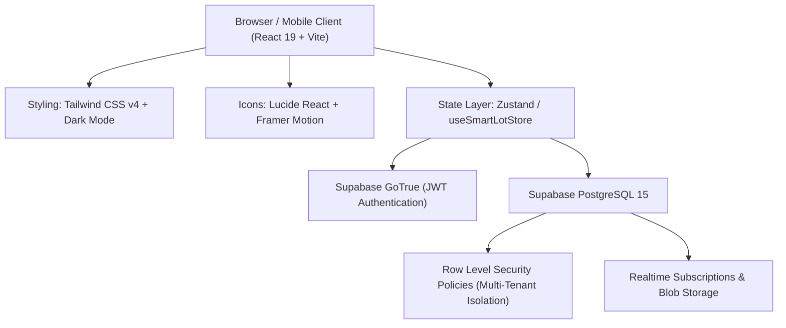
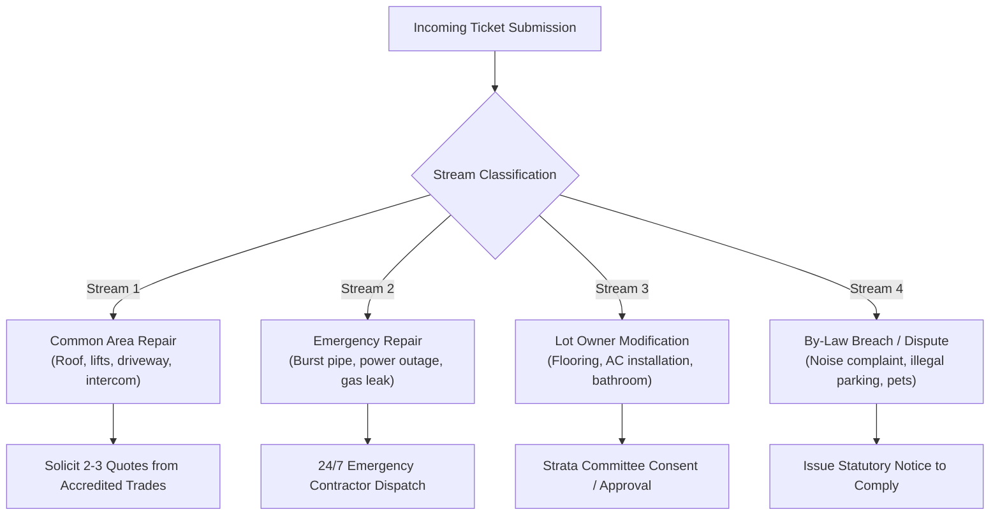
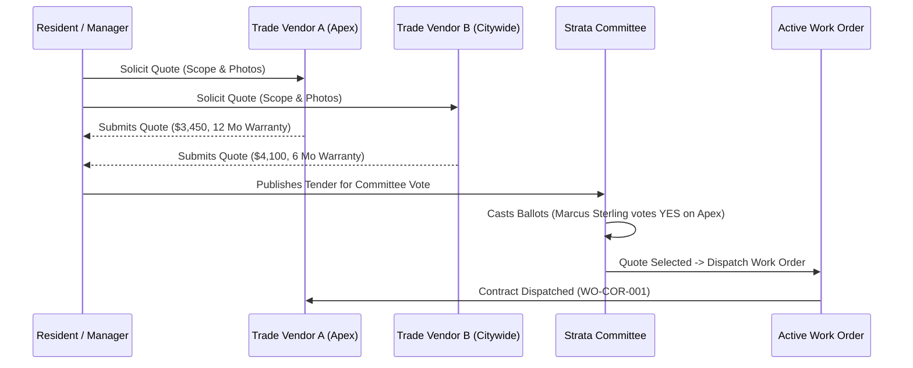

# SmartLot Enterprise Platform Documentation

Comprehensive technical, operational, and architectural documentation for the **SmartLot** Strata Management & Community Operations Platform.

---

## 📑 Table of Contents
1. [Executive Summary & Vision](#1-executive-summary--vision)
2. [Statutory Strata Framework Alignment](#2-statutory-strata-framework-alignment)
3. [System Architecture & Technology Stack](#3-system-architecture--technology-stack)
4. [Multi-Tenant Data Model & RLS Security](#4-multi-tenant-data-model--rls-security)
5. [The 4 Core Platform Portals](#5-the-4-core-platform-portals)
6. [4-Stream Statutory Triage Engine](#6-4-stream-statutory-triage-engine)
7. [Contractor Tender & Work Order Dispatch Pipeline](#7-contractor-tender--work-order-dispatch-pipeline)
8. [Super Admin Control Hub & Remote Inspection](#8-super-admin-control-hub--remote-inspection)
9. [Complete User Persona & Testing Roster](#9-complete-user-persona--testing-roster)
10. [Local Development & Deployment Guide](#10-local-development--deployment-guide)

---

## 1. Executive Summary & Vision

**SmartLot** is an enterprise-grade strata operations platform engineered to digitize, automate, and legally streamline property governance for residential and commercial strata schemes. Built specifically to handle modern multi-unit challenges, SmartLot replaces fragmented spreadsheets, paper noticeboards, and opaque committee email chains with a unified, transparent real-time operating system.

### Key Value Propositions
* **Total Transparency**: Lot owners and tenants track maintenance issues in real-time with Jira-style progress bars and timestamped audit logs.
* **Statutory Compliance**: Automated categorization ensures compliance with statutory responsibilities (such as NSW SSMA 2015 Section 106 repair duties and Section 110 minor renovation approvals).
* **Multi-Site Agility**: Professional strata management agencies can seamlessly toggle across dozens of schemes without logging out.
* **Competitive Quoting**: Multi-vendor quote solicitation with automated committee voting prevents overspending on common property repairs.

---

## 2. Statutory Strata Framework Alignment

SmartLot embeds statutory strata law into its business logic:

| Regulatory Concept | Statutory Standard | SmartLot Implementation |
| :--- | :--- | :--- |
| **Common Property Maintenance** | NSW SSMA 2015 Section 106 | Automatically routes common property defects to the Strata Committee and Managing Agent with statutory triage tracking. |
| **Urgent & Emergency Repairs** | S106(4) / Emergency Provisions | Triggers immediate 24/7 priority flags, emergency contractor dispatch, and automated incident notices to all affected residents. |
| **Lot Owner Modifications** | NSW SSMA 2015 Section 110 | Dedicated cosmetic/minor renovation approval stream requiring committee consent, acoustic specs, and license verification. |
| **By-Law Breaches & Disputes** | NSW SSMA 2015 Section 137 | Multi-step mediation log with notice-to-comply templates, noise timestamp capture, and automated correspondence records. |
| **Financial Authorisation Limits** | Delegated Committee Spending Thresholds | Prevents unauthorized contract awards by enforcing formal committee ballot votes on quotes exceeding statutory expenditure thresholds. |

---

## 3. System Architecture & Technology Stack



### Core Technologies:
* **Frontend Framework**: React 19 (Functional Components, Hooks, Context).
* **Build Engine & Bundler**: Vite v6 with sub-second Hot Module Replacement (HMR).
* **Styling & Design System**: Tailwind CSS v4 with unified CSS variables and dark mode support (`dark:bg-[#07090e]`, `dark:bg-[#0d1117]`).
* **Icons & Animation**: Lucide React, Motion (Framer Motion v12).
* **Data Grids & Visualizations**: AG Grid Community / React for high-performance financial and unit rosters.
* **Database & BaaS**: Supabase PostgreSQL 15 with Postgres Row-Level Security (RLS) and pg_graphql.
* **Edge / Hosting**: Vercel Edge Network with automatic continuous integration.

---

## 4. Multi-Tenant Data Model & RLS Security

The database follows a strict multi-tenant architecture where every record is scoped to a specific strata scheme (`scheme_id`).

### Zero-Trust Row Level Security (RLS)
Following modern OWASP Top 10 guidelines (A01: Broken Access Control), all 22 database tables enforce tenant isolation:
```sql
-- Standard Tenant Isolation Policy (Enforced across all tables)
CREATE POLICY "tenant_scheme_isolation" ON public.resident_requests
FOR SELECT USING (
    EXISTS (
        SELECT 1 FROM public.scheme_members sm
        WHERE sm.scheme_id = resident_requests.scheme_id
          AND sm.profile_id = auth.uid()
    )
    OR EXISTS (
        SELECT 1 FROM public.profiles p
        WHERE p.id = auth.uid() AND p.is_system_admin = TRUE
    )
);
```

### Database Schema Entity Overview:
* `schemes`: Master table for strata plans (e.g., `SP101`, `SP102`, `SP103`, `SP823`).
* `units`: Lot numbers, unit identifiers, and unit entitlements (voting weight percentage).
* `profiles`: Global user accounts linked 1:1 with `auth.users`.
* `scheme_members`: Associative table linking users to schemes with specific roles (Strata Admin, Committee, Owner, Tenant).
* `resident_requests`: Core ticketing engine storing requests, streams, priority, and status.
* `request_quotes`: Vendor tenders submitted against a specific maintenance request.
* `work_orders`: Executed maintenance contracts with assigned contractor, budget, and target completion date.
* `audit_logs`: Append-only immutable history tracking every change, email notification, and vote.

---

## 5. The 4 Core Platform Portals

SmartLot provides customized interfaces depending on user authority:

```
┌────────────────────────────────────────────────────────────────────────┐
│                          SMARTLOT PORTALS                              │
├───────────────────┬───────────────────┬────────────────────────────────┤
│ 1. RESIDENT       │ 2. STRATA MANAGER │ 3. SUPER ADMIN  │ 4. VENDOR    │
│    PORTAL         │    & COMMITTEE    │    CONSOLE      │    PORTAL    │
│                   │                   │                 │              │
│ • Maintenance log │ • 4-Stream Triage │ • Master Roster │ • Trade Reg  │
│ • Status timeline │ • Quote Solicit   │ • Cross-Scheme  │ • Quotes     │
│ • Bylaws library  │ • Committee Vote  │ • Remote Inspect│ • Work Orders│
│ • Noticeboard     │ • Work Orders     │ • Global Perms  │ • Invoices   │
└───────────────────┴───────────────────┴─────────────────┴──────────────┘
```

### 1. Resident & Tenant Portal
* **Clean UI**: Distraction-free noticeboard, building contacts, and request submission form.
* **Role Scoping**: Tenants only see noticeboard items and their own unit requests; Lot Owners see financial notices and scheme-level correspondence.
* **Mobile-Optimized**: Designed for quick photo uploads and instant maintenance reporting on mobile browsers.

### 2. Strata Manager & Committee Workspace
* **Jira-Style Request Review**: 2-column operational workspace with status badges, priority toggles, and email notification logs.
* **Multi-Scheme Switcher**: Instant switching between `SP101`, `SP102`, and `SP103` from the navigation topbar.
* **Team & Permission Matrix**: Granular permission toggles per role (Noticeboard posting, Financial view, Contractor dispatch).

### 3. Super Admin Control Hub (`/#/admin`)
* **Portfolio Governance**: View and manage all schemes, users, units, and requests globally.
* **Remote Inspection Mode**: Impersonate any scheme and role with a persistent top banner to audit configuration or assist committee members.
* **Master Bypass Flag**: Protected access using `is_system_admin = TRUE` or root master passkey (`admin / admin123`).

### 4. Trade Contractor Portal (`/#trade-portal`)
* **Vendor Onboarding**: Compliance upload for contractor license numbers, Public Liability Insurance policies, and expiry tracking.
* **Quote Submission**: Structured quote response (labor, materials, warranty period, estimated days).
* **Work Order Dispatch**: Real-time status updates from dispatch to completion signoff.

---

## 6. 4-Stream Statutory Triage Engine

Every resident ticket is systematically categorized into one of four statutory streams:



1. **Common Area Repair**:
   * Responsibility: Owners Corporation.
   * Action: Building Manager reviews defect, solicits 2-3 quotes, and submits for committee review.
2. **Emergency Repair**:
   * Responsibility: 24/7 Immediate.
   * Action: Bypasses multi-quote requirement; auto-alerts on-call emergency plumber or electrician.
3. **Lot Owner Modification**:
   * Responsibility: Lot Owner (with Owners Corporation consent).
   * Action: Review acoustic reports, trade license, and scope; triggers committee ballot.
4. **By-Law Breach & Noise Complaints**:
   * Responsibility: Managing Agent & Committee.
   * Action: Formal log of dates/times, issuing informal warning or formal Notice to Comply.

---

## 7. Contractor Tender & Work Order Dispatch Pipeline

To prevent kickbacks and cost overruns, SmartLot incorporates a robust quotation tender process:



1. **Tender Creation**: Strata Manager raises a quote request defining scope and attaches photos.
2. **Competitive Bidding**: Accredited contractors submit itemized proposals including pricing, GST, warranty terms, and estimated job duration.
3. **Committee Ballots**: Committee members cast votes (`YES` / `NO` / `ABSTAIN`) directly within the ticket.
4. **Contract Dispatch**: Once approved, SmartLot automatically generates an official Work Order with a purchase reference and dispatches it to the winning contractor.

---

## 8. Super Admin Control Hub & Remote Inspection

### Direct Access
* **Route**: `/#/admin` (or click **System Console** in the top right of the landing page).
* **Master Credentials**:
  * Identifier: `admin`
  * Security Passkey: `admin123` (or click **Auto-fill Master Credentials**).

### Features:
* **Global KPI Overview**: Real-time counts of active schemes, registered lot owners, pending triage tickets, and occupied units.
* **Remote Inspection Wizard**: Click **Inspect Scheme** to enter any building's dashboard as a virtual auditor. A persistent warning banner indicates remote inspection mode with a 1-click **Back to Super Admin** button.
* **Roster Management**: Edit, delete, or reassign lot entitlements and permissions across all buildings.

---

## 9. Complete User Persona & Testing Roster

| Persona | Primary Role | Scheme | Email / Identifier | Password | Access Portal |
| :--- | :--- | :--- | :--- | :--- | :--- |
| **Super Admin** | System Admin | Global Platform | `admin` | `admin123` | `/#/admin` |
| **Emma Wilson** | Strata Manager | Cavalier (`SP103`) & Coronation (`SP102`) | `emma.wilson@agency.com` | `SmartLot2026!` | Management Console |
| **Sarah Jones** | Owner / Strata Admin | Sunset Duplex (`SP101`) | `sarah.jones@duplex.com` | `SmartLot2026!` | Duplex Dashboard |
| **Michael Chen** | Committee Member | Coronation Residences (`SP102`) | `michael.chen@coronation.com` | `SmartLot2026!` | Committee Workspace |
| **David Miller** | Tenant | Sunset Duplex (`SP101`) | `david.m@duplex.com` | `SmartLot2026!` | Tenant Portal |
| **Liam Hemsworth** | Resident | Coronation Residences (`SP102`) | `liam.h@coronation.com` | `SmartLot2026!` | Resident Portal |
| **Chloe Bennett** | Tenant | Coronation Residences (`SP102`) | `chloe.b@coronation.com` | `SmartLot2026!` | Tenant Portal |
| **Oliver Vance** | Resident | Cavalier Grand (`SP103`) | `oliver.v@cavalier.com` | `SmartLot2026!` | Resident Portal |
| **Jessica Taylor** | Tenant | Cavalier Grand (`SP103`) | `jessica.t@cavalier.com` | `SmartLot2026!` | Tenant Portal |
| **Roman Joe** | Strata Manager | Spear Empire (`SP823`) | `romanjoe@gmail.com` | `SmartLot2026!` | Strata Manager Console |
| **Trade Vendor** | Contractor | Commercial Schemes | *Public Registration* | *N/A* | `/#trade-portal` |

---

## 10. Local Development & Deployment Guide

### Installation & Execution
```bash
# 1. Clone the repository
git clone https://github.com/Codewithjainam7/SmartLot.git
cd SmartLot

# 2. Install dependencies
npm install

# 3. Start local development server
npm run dev

# 4. Verify TypeScript compilation
npx tsc --noEmit
```

### Production Build
```bash
npm run build
npm run preview
```

### Deployment Configuration
The app is configured for instant zero-configuration deployment on **Vercel**:
* `framework`: `vite`
* Single-page rewrite rules routed to `/index.html` via [`vercel.json`](file:///f:/SmartLot/vercel.json).
* Live production URL: **`https://smart-lot-five.vercel.app`**.
