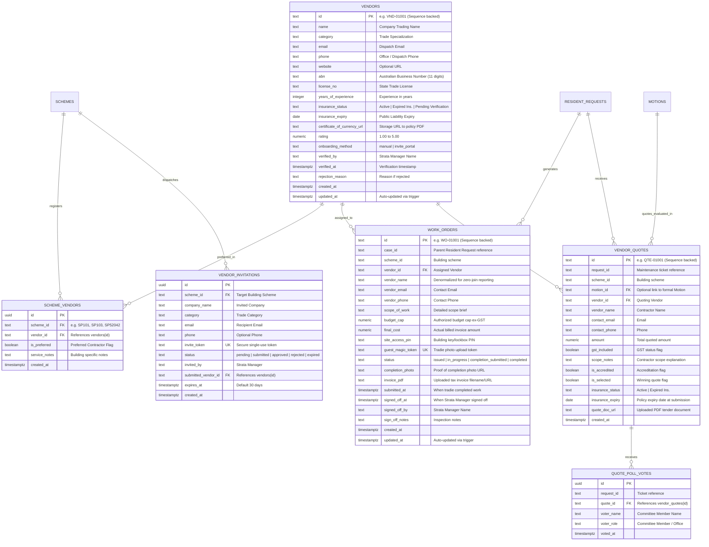

# SmartLot Vendor & Trades Management Database Schema Documentation

This document outlines the database tables, fields, relationships, constraints, and security policies designed for **Vendor Onboarding, Compliance Verification, Competitive Tenders, and Work Order Execution** in SmartLot.

It complies with Australian strata governance standards (**NSW Strata Schemes Management Act 2015** & **VIC Owners Corporations Act 2006**) and adheres to Supabase PostgreSQL performance and security best practices.

---

## 1. Schema Architecture & Entity Relationship Diagram (ERD)



---

## 2. Table Specifications & Architectural Improvements

### `public.vendors`
Stores the master registry of verified building trades and contractors.
* **`id`** (`TEXT PRIMARY KEY`): Sequence-backed (`vendor_id_seq`) with deterministic padding (`VND-01001`), eliminating UUID-truncation collision vulnerabilities.
* **`name`** (`TEXT NOT NULL`): Legal business / trading name.
* **`category`** (`TEXT NOT NULL`): Primary trade (e.g. *Lift & Vertical Transport*, *Plumbing & Drainage*, *Electrical & Lighting*, *Acoustic Engineering*).
* **`abn`** (`TEXT NOT NULL`): 11-digit Australian Business Number.
* **`license_no`** (`TEXT NOT NULL`): State trade qualification / contractor license.
* **`phone`** & **`email`** (`TEXT NOT NULL`): Direct dispatch contacts.
* **`insurance_status`** (`TEXT NOT NULL`): Restricted to `'Active'`, `'Expired Ins.'`, `'Pending Verification'`.
* **`insurance_expiry`** (`DATE NOT NULL`): Expiry of Certificate of Currency ($20M minimum for strata compliance).
* **`certificate_of_currency_url`** (`TEXT`): Storage URL of the policy document.
* **`onboarding_method`** (`TEXT NOT NULL`): `'manual'` (added directly by manager) or `'invite_portal'` (self-registered via trade onboarding link).
* **`rating`** (`NUMERIC(3, 2)`): 1.00 to 5.00 average performance score.
* **`updated_at`**: Maintained automatically via the `handle_updated_at()` trigger.

### `public.scheme_vendors`
Many-to-many relationship establishing which vendors service which strata scheme, including preferred contractor designation.
* **`scheme_id`** (`TEXT NOT NULL`): ID of the strata plan (e.g. `SP101`, `SP103`, `SP52042`).
* **`vendor_id`** (`TEXT NOT NULL REFERENCES vendors(id) ON DELETE CASCADE`): Foreign key with cascade deletion.
* **`is_preferred`** (`BOOLEAN NOT NULL DEFAULT FALSE`): Designates preferred building trade for emergency dispatch.

### `public.vendor_invitations`
Audit log of secure onboarding invitations dispatched to contractors.
* **`invite_token`** (`TEXT NOT NULL UNIQUE`): Cryptographically secure single-use link token.
* **`submitted_vendor_id`** (`TEXT REFERENCES vendors(id) ON DELETE SET NULL`): Indexed foreign key (`idx_vendor_invitations_submitted_vendor_id`) ensuring fast deletes and zero sequential scans.
* **`expires_at`**: 30-day auto-expiry window.

### `public.work_orders`
Digital work order lifecycle tracking tasks from dispatch to completion and manager sign-off.
* **`id`** (`TEXT PRIMARY KEY`): Sequence-backed (`work_order_id_seq`) deterministic identifier (`WO-01001`).
* **`case_id`** (`TEXT NOT NULL`): Linked resident defect or maintenance case.
* **`vendor_id`** (`TEXT NOT NULL REFERENCES vendors(id) ON DELETE RESTRICT`): Prevents deleting active contractors with open work orders.
* **`scope_of_work`** (`TEXT NOT NULL`): Technical work instructions.
* **`budget_cap`** (`NUMERIC(12, 2)`): Spending cap approved by Strata Committee / Manager.
* **`final_cost`** (`NUMERIC(12, 2)`): Actual invoice amount submitted by tradesperson.
* **`site_access_pin`** (`TEXT NOT NULL`): 4-digit PIN for building entry / lockbox.
* **`guest_magic_token`** (`TEXT NOT NULL UNIQUE`): Secure token for zero-login trade portal upload.
* **`status`** (`TEXT NOT NULL`):
  * `'issued'`: Job dispatched; contractor notified with building PIN.
  * `'in_progress'`: Contractor on-site or parts ordered.
  * `'completion_submitted'`: Tradie uploaded completion photo & invoice (triggers **Needs Sign-Off** banner).
  * `'completed'`: Strata Manager reviewed evidence, verified within budget cap, and approved.

### `public.vendor_quotes` & `public.quote_poll_votes`
Australian strata compliance requires 2–3 quotes for works exceeding statutory spending thresholds.
* **`motion_id`** (`TEXT REFERENCES motions(id) ON DELETE SET NULL`): Unifies quotes across both Resident Request triage and formal Committee Motions, preventing redundant duplication.
* **`quote_poll_votes`**: Enforces strict committee voting integrity via `UNIQUE(request_id, voter_name)`.

---

## 3. Zero-Trust Security & RPC Architecture

### Row-Level Security (RLS) Lockdown
The initial prototype policies with `USING (TRUE)` on anonymous roles have been hardened:
1. **No Anonymous Table Snooping**: Unauthenticated users cannot read `work_orders` through PostgREST. This prevents public scraping of building access PINs, defect records, and financial figures.
2. **Restricted Registration**: Anonymous contractors can only `INSERT` into `vendors` with `insurance_status = 'Pending Verification'` and `onboarding_method = 'invite_portal'`.
3. **Exact Token Matching**: Invitations and work orders require exact cryptographic token verification.

### Secure Stored Procedures (RPCs)
Tradies on-site interact with the system without needing a user login via `SECURITY DEFINER` procedures:

```sql
-- 1. Securely fetch a single work order by magic token
SELECT * FROM public.get_work_order_by_guest_token('tok_sp103_wo10483_live');

-- 2. Securely submit work order completion evidence
SELECT public.submit_work_order_completion(
    'tok_sp103_wo10483_live',
    'https://storage.smartlot.internal/completion_photo.jpg',
    'Tax_Invoice_84920.pdf',
    3400.00
);
```

---

## 4. File Locations
* **Hardened Production Migration**: [`supabase/migrations/20260919_vendor_and_work_orders_schema.sql`](file:///f:/SmartLot/supabase/migrations/20260919_vendor_and_work_orders_schema.sql)
* **Master System Schema**: [`supabase_schema.sql`](file:///f:/SmartLot/supabase_schema.sql)
