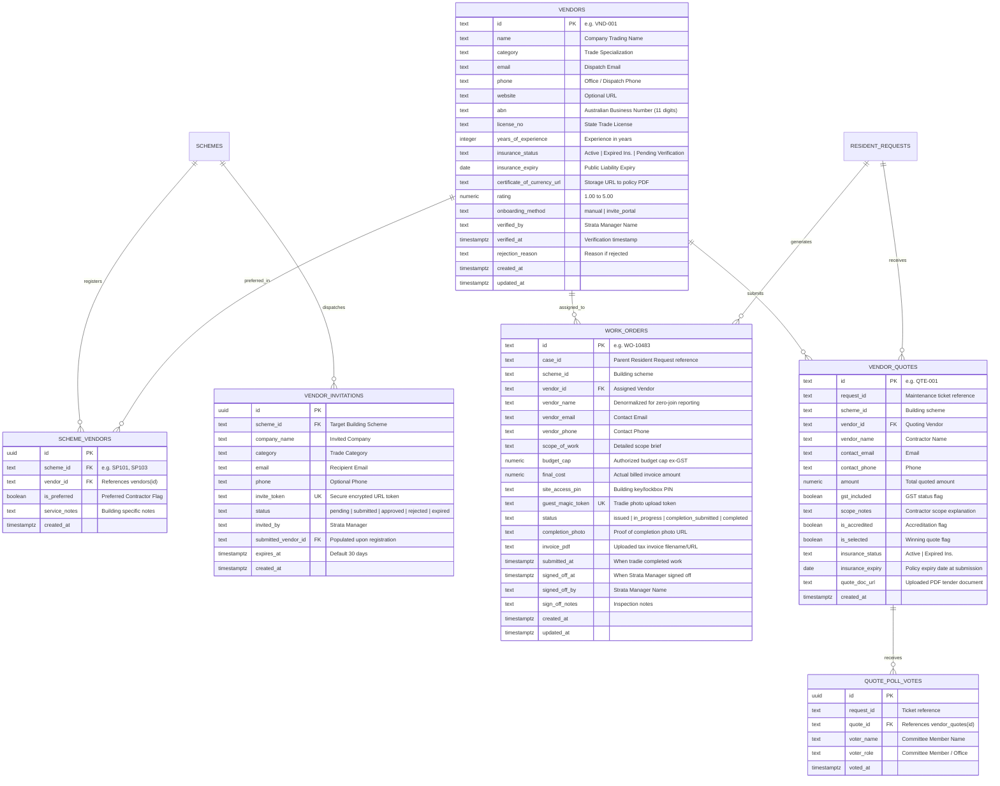

# SmartLot Vendor & Trades Management Database Schema Documentation

This document outlines the database tables, fields, relationships, and constraints designed for **Vendor Onboarding, Compliance Verification, Competitive Tenders, and Work Order Execution** in SmartLot.

It complies with Australian strata governance standards (**NSW SSMA 2015** & **VIC Owners Corporations Act 2006**) and adheres to Supabase PostgreSQL performance best practices.

---

## 1. Schema Architecture & Entity Relationship Diagram (ERD)

---

## 2. Table Specifications & Column Details

### `public.vendors`
Stores directory of certified trades and contractors.
* **`id`** (`TEXT PRIMARY KEY`): Clean standardized ID (`VND-001` or `VND-` + 8 hex characters).
* **`name`** (`TEXT NOT NULL`): Legal business / trading name.
* **`category`** (`TEXT NOT NULL`): Primary trade (e.g. *Lift & Vertical Transport*, *Plumbing & Drainage*, *Electrical & Lighting*, *Acoustic Engineering*).
* **`abn`** (`TEXT NOT NULL`): 11-digit Australian Business Number.
* **`license_no`** (`TEXT NOT NULL`): State trade qualification / contractor license.
* **`phone`** & **`email`** (`TEXT NOT NULL`): Direct dispatch contacts.
* **`insurance_status`** (`TEXT NOT NULL`): Restricted to `'Active'`, `'Expired Ins.'`, `'Pending Verification'`.
* **`insurance_expiry`** (`DATE NOT NULL`): Expiry of Certificate of Currency.
* **`certificate_of_currency_url`** (`TEXT`): Storage URL of the policy document.
* **`onboarding_method`** (`TEXT NOT NULL`): `'manual'` (added directly by strata manager) or `'invite_portal'` (self-registered via trade onboarding link).
* **`rating`** (`NUMERIC(3, 2)`): 1.00 to 5.00 average vendor performance score.

### `public.scheme_vendors`
Many-to-many relationship establishing which vendors service which strata scheme, including preferred contractor designation.
* **`scheme_id`** (`TEXT NOT NULL`): ID of the strata plan (e.g. `SP101`, `SP103`).
* **`vendor_id`** (`TEXT NOT NULL REFERENCES vendors(id)`): Foreign key with cascade deletion.
* **`is_preferred`** (`BOOLEAN NOT NULL DEFAULT FALSE`): Designates preferred building trade for emergency dispatch.

### `public.work_orders`
Digital work order lifecycle tracking tasks from dispatch to completion and manager sign-off.
* **`id`** (`TEXT PRIMARY KEY`): Unique job ID (e.g. `WO-10483`).
* **`case_id`** (`TEXT NOT NULL`): Linked resident defect or maintenance case.
* **`vendor_id`** (`TEXT NOT NULL REFERENCES vendors(id)`): Assigned vendor.
* **`scope_of_work`** (`TEXT NOT NULL`): Technical work instructions.
* **`budget_cap`** (`NUMERIC(12, 2)`): Spending cap approved by Strata Committee / Manager.
* **`final_cost`** (`NUMERIC(12, 2)`): Actual invoice amount submitted by tradesperson.
* **`site_access_pin`** (`TEXT NOT NULL`): 4-digit PIN for building entry / lockbox.
* **`guest_magic_token`** (`TEXT NOT NULL UNIQUE`): Secure token for zero-login trade portal upload.
* **`status`** (`TEXT NOT NULL`):
  * `'issued'`: Job dispatched; contractor notified with building PIN.
  * `'in_progress'`: Contractor on-site or parts ordered.
  * `'completion_submitted'`: Tradie uploaded completion photo & invoice (triggers **Needs Sign-Off** banner).
  * `'completed'`: Strata Manager reviewed evidence, verified within budget cap, and approved.

### `public.vendor_quotes` & `public.quote_poll_votes`
Australian strata compliance requires 2–3 quotes for works exceeding statutory spending thresholds.
* Enables side-by-side comparison.
* Enables Strata Committee voting (`quote_poll_votes`) directly inside the governance hub.

---

## 3. SQL Migration File Location
The runnable, production-ready SQL migration has been placed in:
- [`supabase/migrations/20260919_vendor_and_work_orders_schema.sql`](file:///c:/Users/91960/Documents/Jagrat_Projects/.vscode/Smart_Lot/supabase/migrations/20260919_vendor_and_work_orders_schema.sql)
- And merged into the master schema: [`supabase_schema.sql`](file:///c:/Users/91960/Documents/Jagrat_Projects/.vscode/Smart_Lot/supabase_schema.sql)
